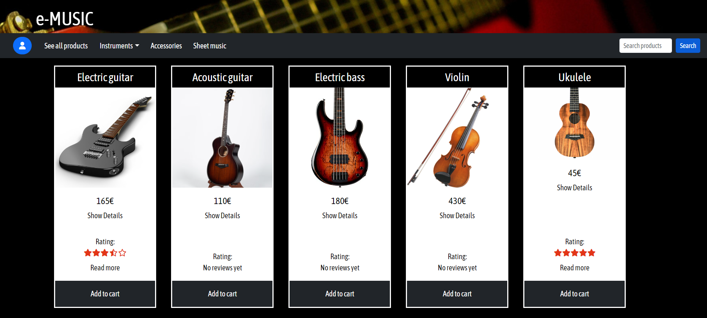
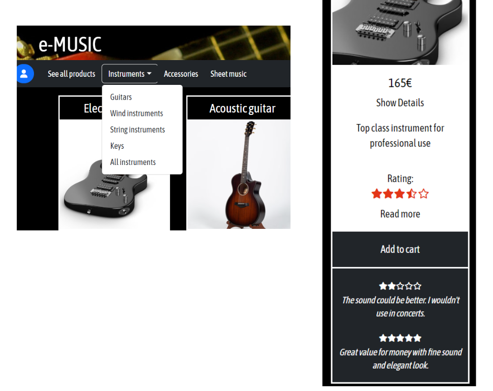
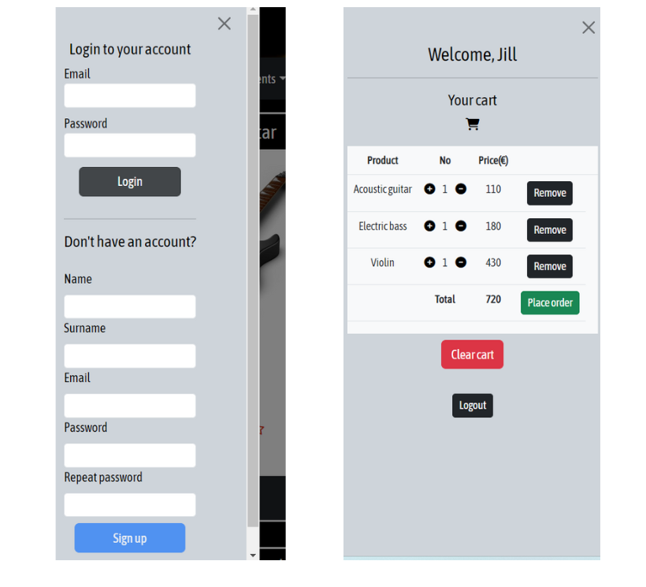
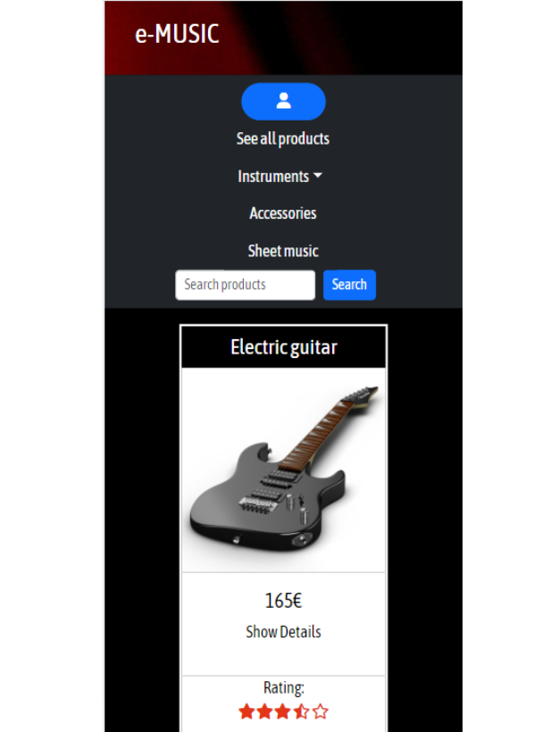

# FrontEnd for Project E-commerce 🖥️ 🛒

## Description

This is a vanilla JavaScript FrontEnd for a backend project that can be found here:

[Project Online shop backend](https://github.com/kbastamow/Project-Online-Shop-Backend-MySQL-Sequelize.git)

This project was an extra for the abovementioned project. As I hadn't used any frontend frameworks yet, I did the project with vanilla Javascript DOM manipulation, HTML, CSS and Bootstrap 5.

## Functionality

The front queries my backend database to retrieve products and user information.

The front has limited functionality as it was created in just a few days:

* It displays products and responds to the different category/name search functions, showing the product, price, description and reviews, as well as calculating an average rating on the client side.

* It allows for login and logout, and displays the shopping cart that has been saved in the user's local storage. Products can be added or deleted from the cart.

Products are displayed as Bootstrap cards. Details and reviews are collapsibles that can be revealed on click.





Login, registration and cart (for logged-in users) are displayed on an offcanvas sidebar that can be opened by clicking the blue profile button.



On mobile devices, the cards increase in width and the navbar stacks vertically.



On hover over product image, this lovely little css styling creates a zoom effect on the image: 

```css
.image-zoom {
    overflow: hidden;
  }
  
  .image-zoom img {
    transition: transform .5s ease;
    max-width: 100;
  }
  
  .image-zoom:hover img {
    transform: scale(1.5);
  }

```
***

## Tech 💻

* HTML, JavaScript - no frameworks
* CSS, Bootstrap 5
* AXIOS
* Created with VS Code

## Author 🦇

* Kbastamow